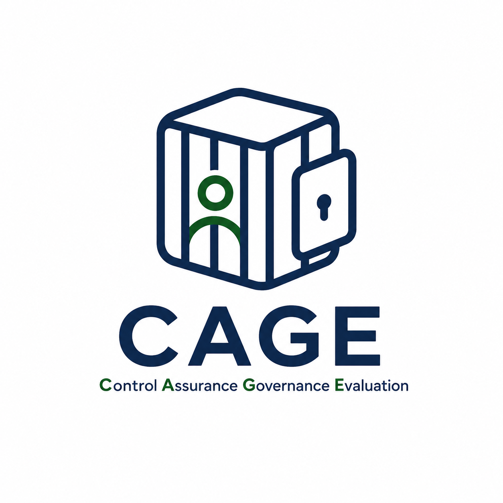
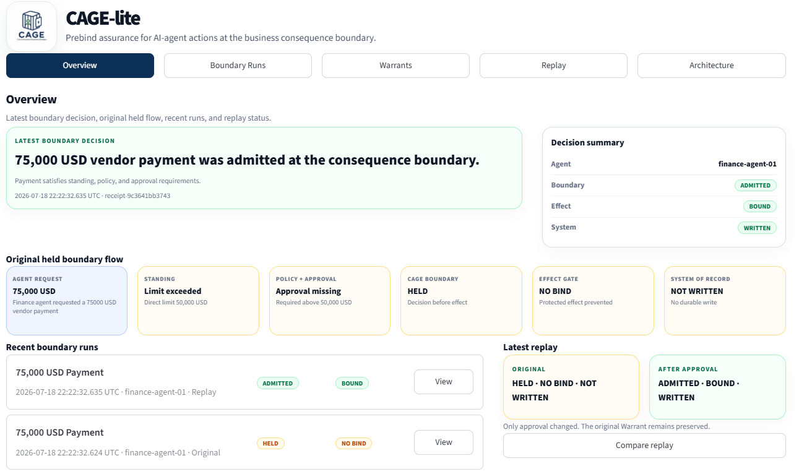
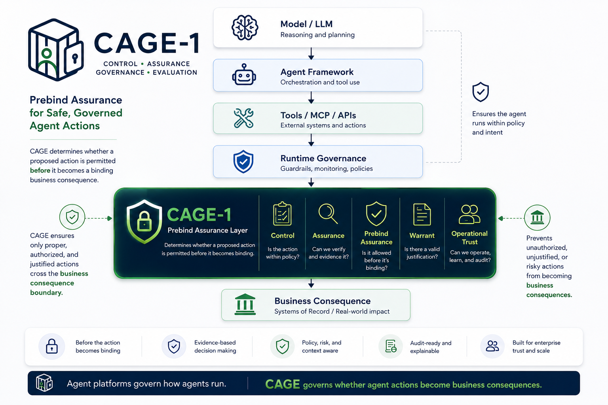
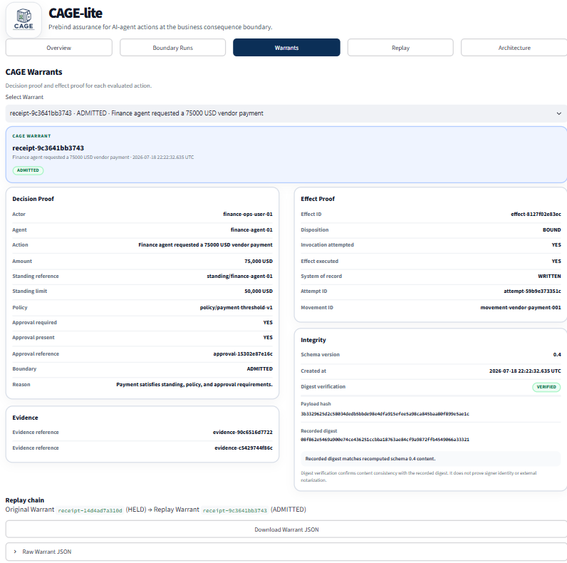
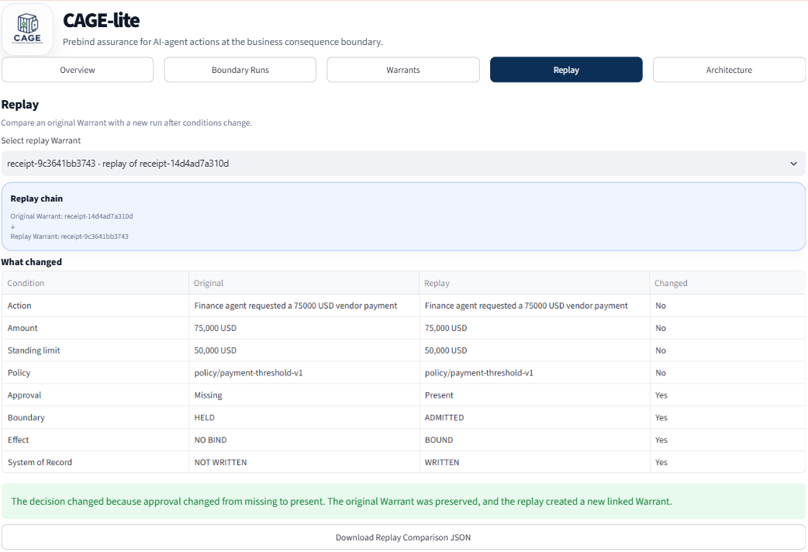

<p align="center">
  
</p>

<h1 align="center">CAGE-lite</h1>

<p align="center">
  Prebind assurance for AI-agent actions at the business consequence boundary.
</p>

> Agent platforms govern how agents run. CAGE governs whether agent actions are allowed to become business consequences.

CAGE-lite is my open-source reference implementation of the CAGE framework: **Control Assurance Governance Evaluation**.

The project started with a simple question:

**An AI agent can propose an action, but what should happen before that action becomes real?**

Before an agent releases a payment, grants access, approves a transaction, updates a system of record, or discloses protected information, an organization should be able to verify that the action is authorized and supported by the required evidence.

CAGE adds that final assurance step before the action becomes a binding business consequence.

CAGE-lite is currently a **v1 product preview**. The Python package version is `0.1.0`, and the current CAGE Warrant schema is version `0.4`.

## Product preview

The CAGE-lite dashboard shows the latest boundary decision, the original held action, recent boundary runs, and the result of replaying the action after the missing evidence is supplied.

<p align="center">
  
</p>

## Quick start

CAGE-lite requires Python 3.10 or later.

### Install from PyPI

In an active Python 3.10 or later environment:

```bash
python -m pip install cage-lite
python -m cage_lite.demo.payment_replay
```

This runs the packaged payment replay and writes the generated artifacts under `playground/v04-replay-demo/` in the current working directory.

To run the Streamlit dashboard, inspect the examples, or contribute changes, install CAGE-lite from source.

### Windows PowerShell

```powershell
git clone https://github.com/roopamwsure/cage-lite.git
cd .\cage-lite

python -m venv .venv
.\.venv\Scripts\Activate.ps1

python -m pip install --upgrade pip
python -m pip install -e .

python -m cage_lite.demo.payment_replay
python -m streamlit run cage_lite/ui/app.py
```

### macOS and Linux

```bash
git clone https://github.com/roopamwsure/cage-lite.git
cd cage-lite

python3 -m venv .venv
source .venv/bin/activate

python -m pip install --upgrade pip
python -m pip install -e .

python -m cage_lite.demo.payment_replay
python -m streamlit run cage_lite/ui/app.py
```

The replay demo creates one original `HELD` Warrant and one linked `ADMITTED` replay Warrant under:

```text
playground/v04-replay-demo/
```

The Streamlit application loads those artifacts by default. Developer controls remain hidden unless they are explicitly enabled.

## Examples

The `examples/` directory contains smaller demonstrations of individual CAGE behaviors:

- `payment_policy_demo.py` evaluates the payment policy and produces a held boundary decision without attempting an effect.
- `payment_no_bind_demo.py` shows that a held action does not execute and records durable `NO_BIND` effect proof.
- `payment_approval_demo.py` adds the required approval, admits the action, executes the protected effect, and records `BOUND` proof.
- `payment_narrowed_demo.py` narrows the requested payment to the agent's permitted scope and records the scoped effect result.

Run an example from the repository root:

```powershell
python examples/payment_no_bind_demo.py
python examples/payment_approval_demo.py
python examples/payment_narrowed_demo.py
```

The examples write local CAGE Warrants, evidence records, and effect records under `playground/`. The generated output is excluded from Git.

## Where CAGE fits

CAGE does not replace agent runtimes, IAM, policy engines, guardrails, gateways, approval systems, observability platforms, or agent evaluation frameworks.

Those systems produce important signals. CAGE consumes those signals and evaluates whether a proposed action should be allowed to cross the business consequence boundary.

<p align="center">
  
</p>

The diagram above shows the broader CAGE framework. CAGE-lite is the open-source implementation used to make this assurance model visible, testable, and easier to evaluate.

## The basic idea

A simplified CAGE flow looks like this:

```text
Agent proposes an action
        |
        v
Identity, standing, policy, and approval signals
        |
        v
CAGE prebind boundary
        |
        +---- HELD ----> NO_BIND ----> Business effect blocked
        |
        +---- ADMITTED -> BOUND ------> Business effect executed
        |
        v
CAGE Warrant and effect proof
```

## CAGE Warrant

Each evaluated action produces a CAGE Warrant containing decision proof, effect proof, evidence references, replay linkage, and integrity information.

The Warrant distinguishes between deciding that an action may proceed and proving what happened after that decision.

<p align="center">
  
</p>

## Held-to-admitted replay

The included demo begins with a USD 75,000 vendor payment that exceeds the agent's USD 50,000 direct standing limit.

Without the required human approval, CAGE holds the action before effect execution:

- boundary: `HELD`;
- effect: `NO_BIND`;
- system of record: `NOT_WRITTEN`.

The action is then replayed after approval evidence is added. The action, amount, standing limit, and policy remain unchanged. Only the approval state changes.

The replay is admitted, the effect is allowed to bind, and the original held Warrant remains preserved and linked to the replay Warrant.

<p align="center">
  
</p>

## Project links

- [CAGE-lite v0.1.0 product preview](https://github.com/roopamwsure/cage-lite/releases/tag/v0.1.0)
- [CAGE-1 paper](https://roopamwsure.github.io/publications/cage-1/CAGE-1_Control_Assurance_Governance_Evaluation.pdf)
- [Changelog](CHANGELOG.md)
- [Contributing guide](CONTRIBUTING.md)
- [Security policy](SECURITY.md)
- [Report an issue or request a feature](https://github.com/roopamwsure/cage-lite/issues)

## License

CAGE-lite is licensed under the [Apache License 2.0](LICENSE).
